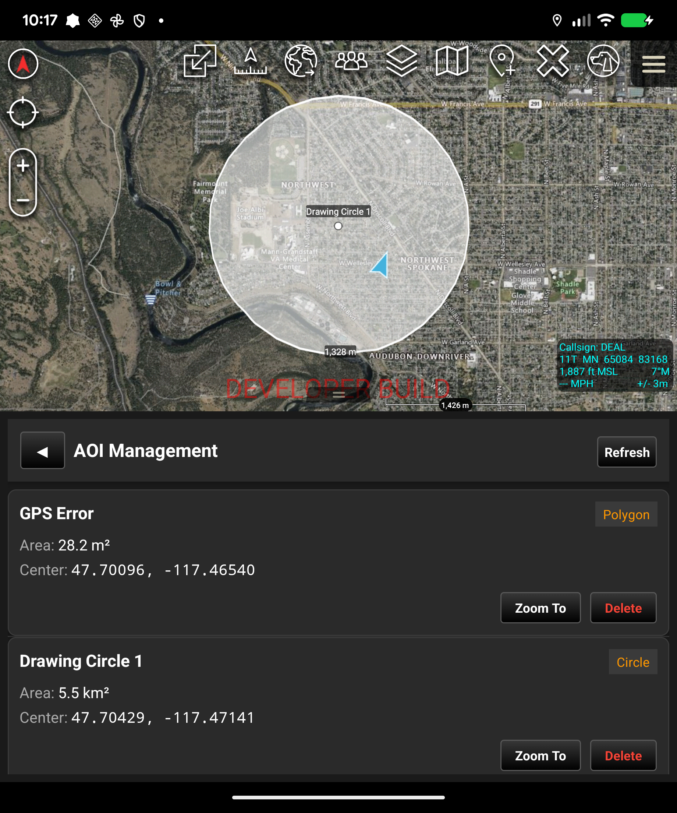

# OmniCOT - ATAK Plugin

[](https://www.civtak.org/)
[](LICENSE)
[](https://developer.android.com/)

A comprehensive ATAK plugin for managing Cursor on Target (CoT) items and Areas of Interest (AOI) with advanced affiliation tracking and geospatial analysis capabilities.

## 📋 Table of Contents

- [Features](#features)
- [Screenshots](#screenshots)
- [Installation](#installation)
- [Usage](#usage)
- [Building from Source](#building-from-source)
- [Contributing](#contributing)
- [Support](#support)
- [License](#license)

## ✨ Features

### 🎯 Main Dashboard
- Unified navigation interface with quick access to all plugin features
- Real-time statistics preview for CoT items and AOIs
- Clean, intuitive card-based navigation

### 📊 Cursor on Target (CoT) Dashboard
- **Real-time CoT Statistics**: Track total CoT items on the map
- **Affiliation Tracking**: 
  - Unknown (Gray)
  - Neutral (Green)
  - Friendly (Blue)
  - Hostile (Red)
- **Update Monitoring**: Track items updated by OmniCOT
- **One-tap Refresh**: Update statistics on demand

### 🗺️ Area of Interest (AOI) Management
- **Shape Detection**: Automatically discovers and lists all drawn shapes
  - Rectangles
  - Circles
  - Custom polygons
- **Detailed Information**:
  - Shape name and type
  - Calculated area (m² or km²)
  - Center coordinates (Lat/Long)
- **Quick Actions**:
  - Zoom to AOI with automatic bounds calculation
  - Delete AOI with confirmation
  - Refresh list to detect new shapes

### 🔧 Affiliation Management
- **Radial Menu Integration**: Right-click any map item to access affiliation options
- **Quick Classification**: Update item affiliation with single tap
- **Visual Feedback**: Immediate icon updates on the map
- **Metadata Tracking**: Marks items as "updated by OmniCOT" for statistics

## 📱 Screenshots

<table>
  <tr>
    <td></td>
    <td></td>
    <td></td>
  </tr>
  <tr>
    <td align="center"><b>Main Dashboard</b></td>
    <td align="center"><b>CoT Statistics</b></td>
    <td align="center"><b>AOI Management</b></td>
  </tr>
</table>

## 📥 Installation

### Prerequisites
- ATAK CIV 5.5.0 or higher
- Android device running Android 5.0 (API 21) or higher

### Install Plugin
1. Download the latest `.apk` from [Releases](https://github.com/jfuginay/omnicot/releases)
2. Transfer to your Android device
3. Install the APK (allow installation from unknown sources if needed)
4. Launch ATAK - the plugin will load automatically
5. Access OmniCOT from the toolbar button

## 🚀 Usage

### Accessing the Plugin
1. Open ATAK
2. Tap the **OmniCOT** button in the toolbar
3. Main dashboard displays with navigation options

### Managing CoT Items
1. From main dashboard, tap **"CoT Dashboard"**
2. View statistics for all CoT items on the map
3. See breakdown by affiliation type
4. Tap **Refresh** to update statistics
5. Tap **Back** to return to main dashboard

### Managing Areas of Interest
1. From main dashboard, tap **"AOI Management"**
2. View all drawn shapes (rectangles, circles, polygons)
3. Tap **Zoom** to center map on specific AOI
4. Tap **Delete** to remove an AOI from the map
5. Tap **Refresh** to detect newly drawn shapes
6. Tap **Back** to return to main dashboard

### Updating Affiliation
1. Long-press (or right-click) any map item
2. Select **"Update Affiliation"** from radial menu
3. Choose new affiliation:
   - Unknown
   - Neutral
   - Friendly
   - Hostile
4. Icon updates immediately on map
5. Item is tracked in CoT statistics

## 🔨 Building from Source

### Requirements
- Java 17 (OpenJDK Temurin recommended)
- Android SDK (compileSdk 35, minSdk 21, targetSdk 34)
- ATAK CIV SDK 5.5.0
- Gradle 8.13 or higher

### Build Steps

1. **Clone the repository**
```bash
git clone https://github.com/jfuginay/omnicot.git
cd omnicot
```

2. **Configure local properties**
```bash
cp template.local.properties local.properties
# Edit local.properties with your SDK paths
```

3. **Build the plugin**
```bash
# For CIV debug build
./gradlew assembleCivDebug

# For CIV release build
./gradlew assembleCivRelease
```

4. **Install on device**
```bash
adb install -r app/build/outputs/apk/civ/debug/ATAK-Plugin-omnicot-*.apk
```

### Gradle Tasks
- `assembleCivDebug` - Build CIV debug APK
- `assembleCivRelease` - Build CIV release APK (requires signing)
- `clean` - Clean build artifacts

## 🤝 Contributing

Contributions are welcome! Please follow these guidelines:

1. **Fork the repository**
2. **Create a feature branch** (`git checkout -b feature/amazing-feature`)
3. **Commit your changes** (`git commit -m 'Add amazing feature'`)
4. **Push to the branch** (`git push origin feature/amazing-feature`)
5. **Open a Pull Request**

### Code Style
- Follow existing code conventions
- Add comments for complex logic
- Update documentation for new features

### Testing
- Test on physical Android devices when possible
- Verify compatibility with ATAK CIV 5.5.0
- Include screenshots for UI changes

## 🐛 Support

### Reporting Issues
Found a bug or have a feature request? Please [open an issue](https://github.com/jfuginay/omnicot/issues) with:

- **Bug Reports**:
  - Description of the problem
  - Steps to reproduce
  - Expected vs actual behavior
  - ATAK version and Android device info
  - Screenshots if applicable

- **Feature Requests**:
  - Clear description of the feature
  - Use case and benefits
  - Any implementation ideas

### Questions & Discussion
- Use [GitHub Discussions](https://github.com/jfuginay/omnicot/discussions) for questions
- Check existing issues before creating new ones

## 📄 License

This project is licensed under the Apache License 2.0 - see the [LICENSE](LICENSE) file for details.

## 👥 Authors

- **J. Fuginay** - *Initial work* - [@jfuginay](https://github.com/jfuginay)

## 🙏 Acknowledgments

- ATAK development team for the excellent SDK
- TAK community for feedback and support
- All contributors who help improve this plugin

## 📊 Project Status

**Current Version**: 0.1  
**Status**: Active Development  
**ATAK Compatibility**: 5.5.0+  
**Last Updated**: October 2025

---

**Note**: This plugin is for use with ATAK (Android Team Awareness Kit). For more information about ATAK, visit [civtak.org](https://www.civtak.org/).
